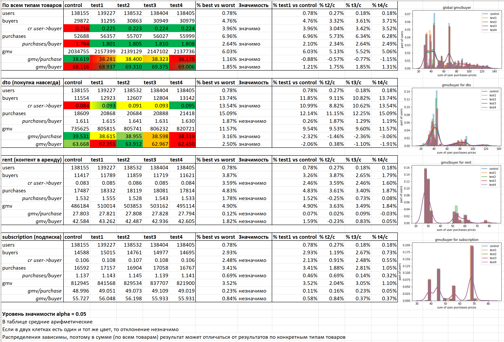

# Тестовое задание для команды продуктовой аналитики Okko

Таблицы users_.csv и purchases_.csv доступны по [ссылке](https://drive.google.com/drive/folders/19_35WLFqmKNka-I1FFJBsShVmSmQx72U?usp=sharing).

#### Выполняет: Никита Лисоветин, студент группы М3439 кафедры КТ университета ИТМО ([telegram](t.me/nikitalisovetin), [github](github.com/turing228))

## Задача: A/B тест

Был запущен сплит-тест (а/б-тест), направленный на улучшение платежной активности пользователей. Вам дан датасет с транзакциями пользователей до и во время теста в контрольной и тестовых группах

1. Какие вы можете сделать выводы? Какая группа показала лучшие результаты?
2. Можем ли мы как-то оценить из этих данных равномерность и валидность распределения юзеров по разным группам?
3. Если не ограничиваться теми данными, которые приведены в рамках этого задания, что ещё вы бы посчитали для оценки результатов групп?

Описание данных:

В таблице users_ приведена информация о том, какой юзер в какой момент времени попал в а/б тест:
tag - лэйбл группы (control - контрольная, остальные - тестовые)
ts - время, когда впервые был выдан tag. То есть, все события до наступления времени ts происходили с юзером до попадания в а/б тест
user_uid - внутренний id юзера (для матчинга со второй таблицей)
registration_time - время регистрации пользователя в сервисе
conv_ts - время совершения первой покупки пользователем в сервисе

В таблице purchases_ приведена информация о транзакциях пользователей из таблицы users_ до и во время а/б теста:
user_uid - внутренний id юзера (для матчинга со второй таблицей)
time - время совершения транзакции
consumption_mode - вид потребления контента (dto - единица контента куплена навсегда, rent - единица контента взята в аренду, subscription - оформлена подписка)
element_uid - уникальный id единицы контента или подписки
price - цена (преобразованная)

Значения в полях price и всех полях, указывающих на время - преобразованы. Это значит, что значение в таблице не настоящее, но является линейным преобразованием реального значения, где ко всем значениям одного поля применено одно и то же преобразование - между ними сохранено отношение порядка. Ко всем полям, обозначающим время, применено одно и то же преобразование.

## Результат

(повторяет результат из `ab_test_task.ipynb`)

## Тест проведен корретно? Равномерно ли распределены пользователи по группам?

По всем основным показателям действий пользователей:
* Время попадания в тест
* Количество покупок до теста
* Сумма покупок до теста
* Средняя цена покупки до теста
* Время регистрации
* Время первой покупки

пользователи распределены равномерно по группам.

Это говорит о том, что с высокой вероятностью они действительно равномерно распределены по группам и результаты анализа будут валидны. Тест был поставлен удачно, такую же стратегию распределения по группам можно использовать и дальше.

Почему "с высокой вероятностью", а не точно? Пользователи выделяются и по другим показателям, такие как: пол, возраст, город, средний доход в городе, зарплата, интересы, последняя подписка на 12 месяцев, смотрят утром или ночью фильмы, карта банка и другие. Существует вероятность того, что "любители детских фильмов" никак не выделялись до теста, но попали в одну группу. А в тесте запустили в разном виде новое предложение с детскими фильмами. Конечно, эти любители сразу начнут покупать их. Мы увидим, что доход увеличился и совершим ошибку: отдадим предпочтение тому варианту, где больше любителей, а не тот, который более прибыльный. Аналогично, если бы, например, нововведения заключалось в скидке для обладателей карта Тинькофф Банк и в одну группу попадут больше их обладателей. Однако, так как изученные показатели действительно хорошие и по ним мы узнали, что распределение по группам равномерное, то вероятность такого очень мала. Но не 0.

В зависимости от поставленной гипотезы и проверяемой фичи дополнительно нужно проверять равномерность распределения по другим параметрам. Если мы, опять же, запускаем детские фильмы, то нужно проверять равномерность распределения по любителям детских фильмов (то есть хотя бы по возрасту или "в браке и >=30 лет (значит, есть ребенок)"). Если запускаем футбол, то нужно проверять, что везде мужчин поровну. Если балет - то женщин. И так далее.

Поняв, что распределение пользователей по группам равномерное, мы теперь можем утверждать, что полученный в процессе анализа результат ценен. Перейдем к нему.

## Результат

Основные метрики, значимость изменений и графики в таблице "NumbersAndGraphics.xlsx" и на ее скриншоте "result.png" представленном ниже:

В тестовых группах выявлены значимые изменения по следующим значениям метрик:

для всех типов товаров: рост конверсии на 3.0-4.0%, рост количества покупок пользователя на 2.1-2.6%, падение суммы заказа на 0.6-1.2%, рост трат пользователя на 1.2-1.9%.

для товаров типа dto (покупка навсегда): рост конверсии на 8.8-13.5%, не изменилось значимо количество покупок пользователя, рост трат пользователя на 0.4% для test2 и падение на 1.1-2.1% для остальных, падение суммы заказа на 1.5-3.1%.

для товаров типа rent и subscription метрики не изменились значимо.

===

**Наибольшие положительные значимые изменения для дохода компании произошли в группе test2.** 

Траты пользователя по всем категориям товаров не изменились значимо для групп test1 и test4, но для товаров категории dto значимо уменьшилась.

Интересно, что траты пользователя по всем категориям товаров увеличились значимо для test3, но значимо упали для категории dto и не изменились значимо для rent и subscription. Это объясняется тем, что dto+rent+subscription/dto/rent/subscription не независимы (действительно, если пользователь купит подписку, то будет покупать меньше фильмов и арендовать их; если арендует фильм, то вряд ли купит его; если купил, то не арендует уже)

## Что дальше?

Мы поняли, что за счет нововведения, снижающего конечную среднюю цену товаров, пользователи начинают значимо чаще совершать заказы и тратить в итоге больше денег. Причем важен сам факт скидки и из-за этого факта происходит "скачок" метрик. С дальнейшим снижением цены количество покупок на пользователя не увеличивается, но суммарные траты пользователя быстро уменьшаются. Теперь главные вопросы:
* Почему? Раньше ведь цена тоже варьировалась
* Как мы можем еще помочь пользователям принимать решение о покупке?
* Как нам дальше развивать продукт и увеличивать прибыль?

Чтобы ответить на них нужно понять (под пунктами примеры ситуаций):
1. Что именно отличается в тестовом и контрольном дизайнах и как это может логически влиять на совершение/не совершение заказа + сравнить с конкурентами с похожими товарами
    * Пользователи теперь показывается, что "это скидка", а не безмолвно меняется цена
    * В тестовом дизайне делается небольшая скидка и на весь экран пишут "успей, пока цена снижена!". Из-за давления пользователи начинают совершать покупки
    * Эти товары были в списке "понравившихся" и мы просто сообщили пользователю, что на них вот наконец случилась скидка и он купил
    * Мы сообщили, что с заказа оплаченного с помощью карты Тинькофф Банка дается кешбек 1-3%, и это стало решающим для некоторых пользователей
    * Рекомендации со скидками начали работать гораздо лучше и пользователи начали чаще пользоваться ими
    * Возможно, что скидки временами всегда были, но появились "отложенные" и кнопка "уведомить о снижении цены" и пользователи пользуются ими, теперь им удобно следить за ценами, они чаще замечают снижение цены и действительно покупают
    * В тестовом дизайне сразу в лицо пользователя показывают какие фильмы "вот только что вышли", а на новые фильмы небольшая скидка
    * Появилась реферальная программа, за которую дают скидки на фильмы. Пользователь приглашает друга и сразу пользуется этой скидкой
    * Появилась накопительная программа бонусов и скидок за покупки, с которой пользователям действительно интереснее стало совершать покупки
1. Мы не знаем какое именно нововведение было, поэтому интересно, что отличает тестовые группы друг от друга и почему test2 лучше остальных, а конверсия test4 по dto выше, чем у других групп
    * Скидка демонстрируется более заметным образом
    * Рекомендации сработали лучше: больше фильмов на тему, которая близка пользователю; больше высокорейтинговых фильмов, которые он не видел еще; больше новинок в карусели рекомендаций; рекомендации "похожих" точнее и т.п.
    * Кнопка "купить" крупнее и заметнее
    * Просто размер скидки больше и пользователи охотнее покупают
    * Важен просто факт скидки, а у test2 наименьшее снижение цены, соответственно, скачкообразное увеличение цены компенсировала с лихом уменьшение средней цены товара

## Несколько задач для аналитиков

1. Посмотреть на поведение пользователей из группы control и test2 (и других тестовых). Что делают пользователи перед покупкой товара? Сравнивают его с другими? Просматривают рекомендации? Нажимают кнопку "поделиться"? Проверяют "отложенные"? Проходят по ссылке из почтовой рассылки?
1. Изучить данные, связанные с конкретным нововведением, и понять, что еще отличает контрольную от тестовых групп, тестовые группы друг от друга и почему test2 лучшая. Если это карусель с рекомендациями фильмов, то можно посмотреть на долю фильмов про спорт, долю новинок, рейтинг фильмов, рейтинг новинок, сколько из них фильмов, на которые пользователь уже тыкал и т.п. Если это просто скидка, то какой размер скидки, как зависит скидка от фильма (на новые или на старые, популярные, новинки, про спорт, из "отложенных", "просмотренные несколько раз").
1. **Не про это нововведение:** посмотреть от чего зависит популярность покупок фильмов (до и после начала теста были популярны разные фильмы), связано ли это с тем, что популярные фильмы "актуальны ситуации в мире", соответствуют времени года, событию (новый год, день влюбленных или SpaceX отправил человека на МКС и стали популярны фильмы про космос), просто новые или новые с высоким рейтингом.
1. Проверить равномерность распределения пользователям по группам в зависимости от других параметров, например, сильноспецифичных для этого нововведения. Если нововведение -- скидка за оплату по Тинькофф, то проверить, что везде одинаковая доля тех, кто пользовался картой Тинькофф. Или по параметрам наподобие вида последней оформленной подписки, сколько времени еще будет действовать и т.п.
1. Сравнить прибыль по группам, а не доходы с покупок.
1. Сравнить доходы по пользователям в единицу времени (сколько тратит в месяц), а не за все время тестирования.

## Вердикт

Split тестирование проведено качественно и однозначно успешно: тестовые группы и, в особенности, вторая, показали значимый рост метрик связанных с доходом (рост конверсии на 3.0-4.0%, рост количества покупок пользователя на 2.1-2.6% и рост трат пользователя на 1.2-1.9%). При рассмотрении отдельных типов товаров значимые изменения обнаружились лишь по продуктам типа dto, покупаемые пользователями навсегда (составляют ~37% от общего дохода и количества заказов), где произошел рост конверсии на 8.8-13.5%. Вместе с тем средняя стоимость заказа и товаров снизилась (на 0.6-1.2%)

Со скидкой произошел скачок конверсии и количества покупок на пользователя. При незначительном снижении скачок компенсирует это падение и в итоге получается доход значительно выше, чем в контрольной группе (в группах test2 и test3). В группе test2, в которой цена снизилась меньше всего, траты пользователя и по всем типам товаров, и по dto максимальны, в то время как в других группах конверсия оба раза выше, но траты пользователя по dto упали. Что дает основания сделать вывод, что test2 -- лучшая группа с точки зрения дохода компании (но не по конверсии). Из этого можно сделать вывод, что, скорее всего, просто факт скидки увеличивает конверсию и ее можно сделать достаточно малой, чтобы общий доход увеличился.

При принятии решения о дальнейшей раскатке нововведения важно помнить, что доход != прибыль. Хоть доход и конверсия и выше в тестовых группах, прибыль могла снизиться, что делает нецелесообразным дальнейшую раскатку нововведения, если нам сейчас важна прибыль. Также, возможно, целесообразно оставить нововведения только для товаров dto (если оно было для всех товаров), если это экономит что-либо: железо (если меньше данных хранить и считать нужно или скорость выдачи понижаем), работу операторов чатов, работу фотографов, редакторов). А для товаров dto усилить сильные стороны решения test2. Дополнительная аналитика и понимание нововведения поможет лучше понять, что побудило пользователей совершать больше заказов, какие новые идеи могут помочь пользователям и, соответственно, увеличить нашу прибыль. 